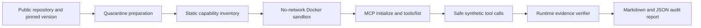

# MCP Audit Lab

MCP Audit Lab is an evidence-backed pre-install auditor for open-source TypeScript/Node MCP servers that run locally over `stdio`. It helps developers and platform engineers decide whether a third-party MCP server deserves installation approval.

> This is an audit aid, not a safety certificate. It was evaluated on synthetic fixtures and one documented vulnerable/patched public repository pair. Absence of a finding is not proof that arbitrary MCP software is safe.

## Problem and intended user

A developer considering a third-party local MCP server has a difficult trust problem. A README and tool list explain what the server claims to do, but installation or runtime code may also read credentials, mutate files, contact the network or construct shell commands from tool input. Manually reviewing an unfamiliar repository, its dependencies and its runtime behavior is slow and inconsistent.

The intended user is a developer, security reviewer or platform engineer who has the source repository and launch command for a local Node MCP server. The useful final output is a reproducible Markdown and JSON report that connects each risk claim to a source line, protocol response or runtime trace.

## What the audit agent does

The project uses one audit workflow agent. Docker preparation, static scanning, MCP probing and evidence verification are tools used by that agent; they are not separate agents.



The workflow:

1. Pins and prepares a public GitHub repository in disposable containers.
2. Installs dependencies with lifecycle scripts disabled and builds without network access.
3. Inventories source-level process, filesystem, environment, network, dependency and installation capabilities.
4. Refuses to execute the target if the Docker sandbox is unavailable.
5. Initializes the MCP protocol, discovers tools and probes them with synthetic inputs.
6. Records Node runtime events with executable, argument-array and shell metadata.
7. Applies policy and produces evidence-backed findings for human review.

The complete decision rules are in [AGENT_INSTRUCTIONS.md](AGENT_INSTRUCTIONS.md).

## Why the result is useful

The report separates three ideas that are often collapsed into one alarming risk score:

- A static capability means the code can perform an action and requires review.
- A confirmed runtime event means a probed path attempted the action.
- Policy decides whether an observed action is expected, reviewable or prohibited.

For example, a Kubernetes MCP server is expected to invoke `kubectl`. A direct call such as `execFileSync("kubectl", ["get", "pods"])` can be explicitly approved. A shell command string such as `execSync("kubectl ... " + userInput)` remains critical because shell interpretation creates a command-injection boundary.

## Measured result

The primary metric is **high-risk finding recall** on ten fixtures whose expected findings were declared before evaluation. The baseline and final workflow receive the same cases.

| Method | High-risk findings detected | Recall | Unexpected high-risk findings |
|---|---:|---:|---:|
| Documentation/tool-catalog baseline | 0/7 | 0% | 0 |
| Static analysis plus sandboxed runtime probe | 7/7 | 100% | 0 |

Expectations are matched within each fixture, so a finding from one case cannot earn credit for another case. The difficult fixture hides a conditional filesystem write that static pattern matching alone does not explain; the runtime probe exposes it.

The same workflow was applied to the public `Flux159/mcp-server-kubernetes` repository:

| Version | Static shell sites | Confirmed runtime shell attempts | Result for command-injection check |
|---|---:|---:|---|
| `v2.4.9` | 23 | 14 | Fail |
| `v2.5.0` | 0 | 0 | Pass |

The patched version still produced one approved direct `kubectl` call and one medium-severity `helm` review item. Passing this specific check does not establish that the entire server is safe.

## Quick start

Requirements: Node.js 20 or newer, npm and a running Docker daemon.

```bash
npm ci
npm test
npm run evaluate
```

The evaluation writes `reports/evaluation.json`. For one included fixture:

```bash
npm run baseline -- fixtures/case-05-secret-env case-05-secret-env
npm run audit -- fixtures/case-05-secret-env case-05-secret-env
```

For a target whose entrypoint is not `server.cjs`, provide a direct command:

```bash
npm run audit -- /path/to/target target-id --command node dist/index.js
```

Arguments after `--command` are passed directly without constructing a host shell string. If a direct executable is part of the server's intended job, approve it explicitly:

```bash
npm run audit -- /path/to/target target-id --allow-executable kubectl --command node dist/index.js
```

See [REPRODUCTION.md](REPRODUCTION.md) for clean-environment setup and the exact vulnerable/patched comparison.

## Quarantine preparation

Do not clone or install an untrusted MCP repository directly on the host. The preparation command accepts only HTTPS GitHub URLs and performs acquisition in disposable Docker containers:

```bash
npm run prepare-repo -- https://github.com/OWNER/REPOSITORY.git TAG_OR_COMMIT /tmp/mcp-quarantine-example
```

Network is enabled only during clone and dependency download. npm lifecycle scripts are disabled. The build has no network. Failed preparation directories are retained for inspection and must be removed only by explicitly naming the disposable directory.

## Safety boundaries

Target execution uses Docker with:

- no external network;
- a read-only target mount;
- no real credentials or private configuration;
- all Linux capabilities dropped;
- `no-new-privileges`;
- CPU, memory and process limits;
- a small, non-executable temporary filesystem.

The runtime observer is a Node preload guard, not a kernel-level monitor. Consequential actions remain subject to human review; this project never automatically approves or installs an audited server into a real MCP client.

## Evidence and submission materials

- [Improvement changelog](CHANGELOG.md)
- [Evaluation report](reports/evaluation.md)
- [Machine-readable evaluation](reports/evaluation.json)
- [Vulnerable/patched comparison](reports/kubernetes-version-comparison.md)
- [v2.4.9 report](reports/kubernetes-v249-audit.md)
- [v2.5.0 report](reports/kubernetes-v250-audit.md)
- [Sanitized agent trajectory](trajectories/kubernetes-comparison.md)
- [Five-minute video script](VIDEO_SCRIPT.md)
- [Submission compliance checklist](SUBMISSION_CHECKLIST.md)

## Improvement Changelog

The complete evidence-linked progression is in [CHANGELOG.md](CHANGELOG.md). The largest improvement came from runtime verification and policy-aware process classification: the auditor records the operation, executable, arguments and shell status instead of treating every subprocess call as equally dangerous. An unrestricted host-execution experiment was rejected because an audit tool must fail closed when isolation is unavailable.

## Main failure mode

The probe uses synthetic example arguments and cannot reach every input-dependent branch. Static analysis can reveal a capability without proving it is exercised, while runtime analysis can miss dormant behavior. The report therefore preserves both signals and their confidence instead of presenting a universal safety verdict.

## Hot take

**An MCP security score is less useful than the shortest reproducible path from a risk claim to evidence.** Reliable agent audits should show what was inspected, what was attempted, which policy made it acceptable or unacceptable and what the sandbox prevented the test from proving.

## Provenance

The MCP Audit Lab implementation and its synthetic fixtures were created for this hackathon. The public weather and Kubernetes MCP repositories are external audit targets and are not redistributed as project source. The project uses Node.js, npm and Docker according to their respective licenses and terms.

The official event page is the [micro1 Frontier Engineering Challenge 2026](https://www.hackerearth.com/community/challenges/hackathon/micro1-frontier-engineering-challenge-2026/).

Source repository: https://github.com/relentless-pursuit/mcp-audit-lab
